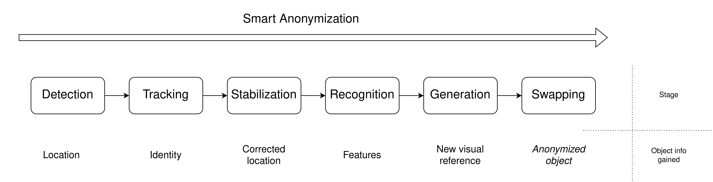

Smart Anonymization System
=============================

Smart Anonymization System performs customized anonymization of videos and images that shall lead to unnoticeable graphical contents modification. Smart anonymization refers to sequential frames processing that is defined as follows:

<br/>

<br/>

Each step of the above sequence is implemented by a solution, so-called "Worker". Configuration of solutions used is done during runtime of the system. To see a list of built-in solutions, see chapter [Build-in solutions](#built-in-solutions). System allows integration of new solution and measurement its performance in terms of execution resources cost. 

Example of anonymized license plates in video:


Example of anonymized faces in video:


More examples can be found [here](_README/MoreExamples.md).

The above results quality is not the main goal of the system implementation. It is designed to allow a developer to deploy and test a new solution in a predefined processing method. SW architecture enables an easy integration of a new solution into the system. Design is object-oriented and interaction between solutions is standardized. To learn how to integrate your own solution, go to the section [How to integrate your own solution](#how-to-integrate-your-own-solution). 

There are two leading use cases where this system can be used:
- Anonymizing the videos and images in a customized way
- Compare one solution with others by evaluating results and execution cost

Execution of smart anonymization sequence generates results of measurement resources cost of execution in text format ([example](_README/WorkersPerformanceStr.txt)) and JSON format ([example](_README/WorkersPerformance.json)). Console logs example can be found [here](_README/ConsoleLogs.log).

## Installation

### Ubuntu
Tested on versions: 22.04.2 LTS, 20.04.6 LTS, 20.04.4 LTS.

To install the system, do the following:
0) Make sure there is no internet connection issues, system time clock is properly set and there are no broken packages
1) Open terminal console
2) Clone this repository
3) Change directory to repository root folder
4) Execute the following command to use CPU-only processing:
```
sudo bash ./Installation/install.sh CPU
```
Alternatively, to try GPU support automated installation, run (not recommended):
```
sudo bash ./Installation/install.sh GPU
```
Automated installation of GPU-supported processing is not recommended because it is more vulnerable to HW configuration changes. In this case, manual installation is recommended.

NOTE: The above steps when succeeded leads to the following results:
- Installation of Python 3.10 in host operating system
- Installation of virtual environment inside ./Installation folder
- Installation of the following libraries (OS - host operating system, venv - virtual environment):
  - DeepPrivacy (venv)
  - Dlib (venv)
  - Nvidia drivers (OS + venv)
  - OpenCV (OS + venv)
  - PyTorch (venv)
  - Tensorflow (venv)
  - cmake, unsip, yasm, git, wget and others (OS)
  - scipy, graphviz, mtcnn, psutil, gdown and others (venv)
- Update of host operating system repository (“sudo apt update”)

### Windows
Tested on version: Windows 11 Home

The following SW can be run on Windows with WSL version 2 (Windows Subsystem for Linux) support of Ubuntu virtualization. To do that, this following instruction might be helpful: [InstallWSL](_README/InstallWSL.md).

Whenver WSL 2 is installed, and Ubuntu subsystem is available, continue installation with the instruction described in [Ubuntu](#ubuntu) section above.

## Run
To run the system, do the following:
1) Make sure project is properly installed (see [Installation](#installation) chapter)
3) Open terminal console and navigate to repository root folder
4) When using CPU-only processing, execute the following:
```
./Installation/CPU/env/bin/python ./System/main.py
```
In case of GPU support installed execute:
```
./Installation/GPU/env/bin/python ./System/main.py
```
Alternatively, you can activate the virtual environment first and then run the system using the following commands:
```
source ./Installation/activate.sh
cd System
python ./main.py
```
5) When GUI interface is launched, decide how processing configuration should look like and start processing by clicking "Exit & Run Processing"
7) By default, input images and videos are taken from directory "./ userFiles/inputs" and are processed into folder "./ userFiles/outputs"

## Run - minimalistic
To reduce integration challenges by limiting the number of available solutions or to run the simple use case of blurring faces, do the following:
1) Make sure project is properly installed
2) Open terminal console and navigate to repository root folder
3) Change system integration configuration by executing the following commands:
```
mv ./System/Configuration/integrationCfg.py ./System/Configuration/integrationCfg.py.bak
mv ./System/Configuration/integrationCfg_minimal.py ./System/Configuration/integrationCfg.py
```
4) Perform anonymization running:
```
./Installation/CPU/env/bin/python ./System/main.py -no-edit -cfg ./userFiles/cfg/Example_light.json
```
5) Restore system integration configuration with:
```
mv ./System/Configuration/integrationCfg.py ./System/Configuration/integrationCfg_minimal.py
mv ./System/Configuration/integrationCfg.py.bak ./System/Configuration/integrationCfg.py
```
6) Compare input images and videos in "./ userFiles/inputs" with modified ones in "./ userFiles/outputs"

## Built-in solutions
By default, the system integrates the following solutions (so-called "Workers"):

Face detectors:
- Haar (https://github.com/opencv/opencv)
- DlibHOG (https://github.com/davisking/dlib)
- DlibCNN (https://github.com/davisking/dlib)
- MTCNN (https://pypi.org/project/mtcnn/)
- Dnn (https://github.com/opencv/opencv)
- YuNet (https://github.com/opencv/opencv_zoo/tree/master/models/face_detection_yunet)
- UnderstandAI (https://github.com/understand-ai/anonymizer)

License plate detectors:
- WpodNet (https://github.com/quangnhat185/Plate_detect_and_recognize)
- LPD_YuNet (https://github.com/opencv/opencv_zoo/tree/master/models/license_plate_detection_yunet)
- UnderstandAI (https://github.com/understand-ai/anonymizer)

Trackers:
- SORT (https://github.com/abewley/sort)
- DeepSort (https://github.com/nwojke/deep_sort)

Stabilizers:
- Kalman filter

License plate recognizers:
- EasyOCR (https://github.com/sergiomsilva/alpr-unconstrained)

License plate generators:
- Most matching pre-generated example image randomly chosen with respect to Levenstein string distance of full set of object recognitions

Face generators:
- DeepPrivacy (https://github.com/hukkelas/DeepPrivacy)
- StyleGAN (https://thispersondoesnotexist.com - results only)

Swappers:
- Clone swapper (https://github.com/opencv/opencv)
- Seamless clone swapper (https://github.com/opencv/opencv)

Face swappers:
- WuHuikai (https://github.com/wuhuikai/FaceSwap)
- Dlib classifier decision tree key points based triangular swap

The system also integrates classic anonymizers that can be used instead of three last stages: recognition, generation and swapping. Instances are the following: Gaussian blur, resolution downgrade, white noise, average or black color area filling.

## How to integrate your own solution

To learn how to integrate a new solution(so-called "Worker") to the system, compare the following files:

- System/Configuration/integrationCfg_minimal.py
- System/Configuration/integrationCfg.py
  
The difference that might be noticed is the way you shall follow to make new solution available/integrated into the system.

Additionally, during component(new solution) implementation, keep in mind that there are some constraints (on interfaces, classes inheritance and others) that have to be fulfilled, otherwise execution error is raised.

NOTE: There is nothing against implementing a solution (so-called "Worker") with local frontend and remote backend.

## Uninstall
To uninstall this project by removing virtual environment, execute the following terminal command after working directory is changed to repository root folder:
```
sudo bash ./Installation/uninstall.sh
```
NOTE: Uninstallation process do not interfere with the host operating system environment unlike installation process. That is why installing and uninstalling the project might have an impact on host operating system environment.


## License
This project is under GPL License, however it also integrates external public solutions. Implementation of integrated external solutions is isolated in terms of folders structure, dedicated files and python class encapsulation mechanism. Project code contains appropriate notes that notify whenever the external solution is used. In such case, license type and source code location are explicitly indicated to preserve author copyrights. The project uses the following external solutions:
- https://github.com/hukkelas/DeepPrivacy (MIT License)
- https://github.com/sergiomsilva/alpr-unconstrained (MIT License)
- https://github.com/wuhuikai/FaceSwap (Personal permission: https://github.com/wuhuikai/FaceSwap/issues/46)
- https://github.com/davisking/dlib (Boost Software License)
- https://opencv.org (Apache 2.0 License)
- https://pypi.org/project/mtcnn (MIT License)
- https://github.com/opencv/opencv_zoo/tree/master/models/face_detection_yunet (MIT License)
- https://github.com/opencv/opencv_zoo/tree/master/models/license_plate_detection_yunet (Apache 2.0 License)
- https://github.com/quangnhat185/Plate_detect_and_recognize (MIT License)
- https://github.com/understand-ai/anonymizer (Apache 2.0 License)
- https://github.com/nwojke/deep_sort (GPL License)


## Known issues
The following higher severity issues are known:
- Tkinter objects destruction process fails (what is not visible to user). This issue is fixed by a workaround
- GUI loading and exiting time is long
- GUI frontend is strongly integrated with the backend of the configuration process (what is done by design to gain benefit of dynamic loading, interaction and data validation, but the concept of frontend-backend interaction is pretty complicated)

Please keep in mind that there might be plenty of unknown issues and many potential fields of improvement.
