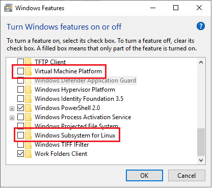
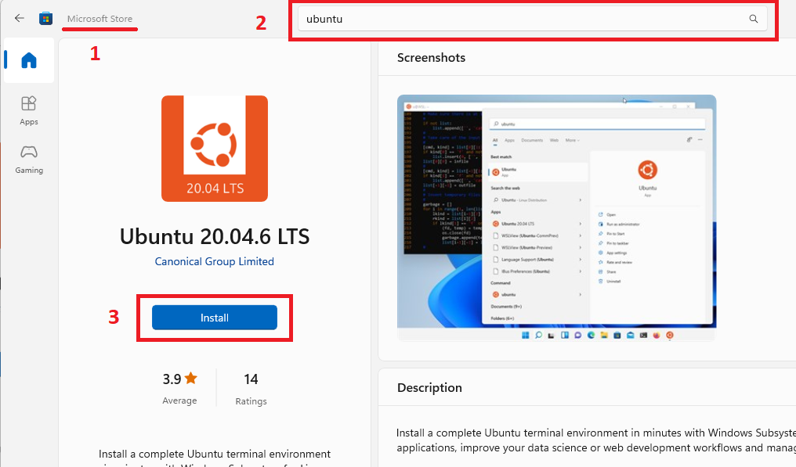

To install WSL 2 on Windows execute the following steps:

1) Enable "Virtual Machine Platform" and "Windows Subsystems for Linux" features:



2) Update wsl by executing the following commands in cmd:
```
wsl --update
wsl --set-default-version 2
```
3) Install Ubuntu subsystem. To do that with assistance of Microsoft Store, do as follows:



4) Run subsystem, configure user name and password and when terminal prompt is available, Ubuntu subsystem is installed.

